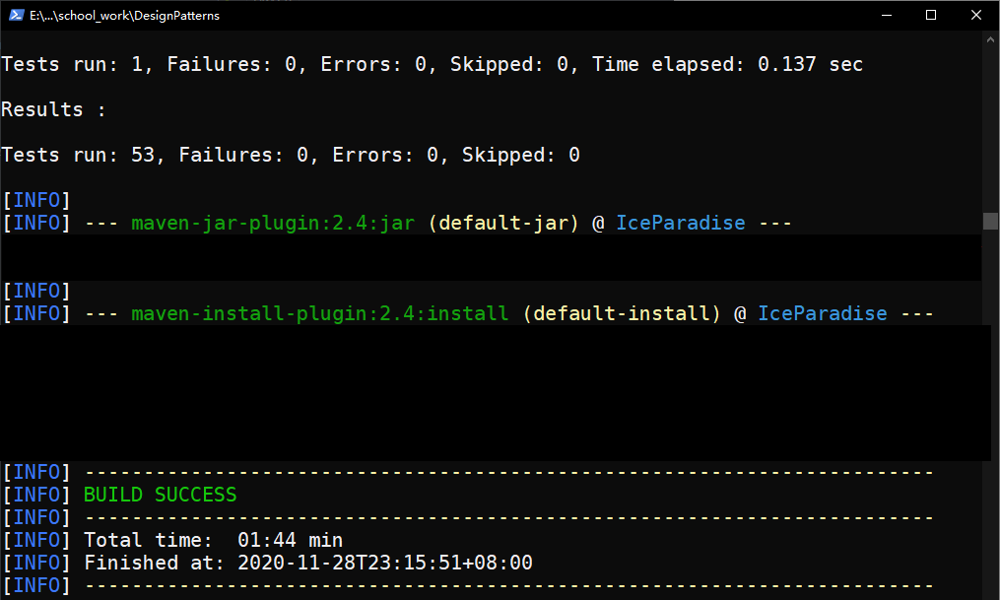
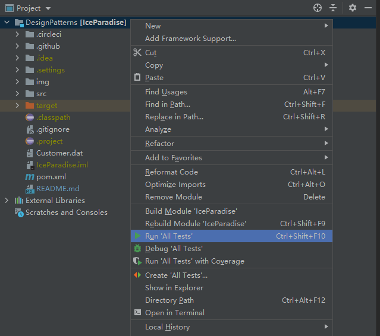
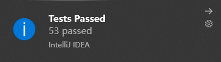

# DesignPatterns

同济大学软件学院 2020-2021 学年 第 1 学期设计模式课程小组项目

## 项目依赖

`JDK >= 8`

`Maven`

`IntelliJ IDEA`

## 在命令行环境下运行测试

1. 获取项目源码。
2. 确保 `Maven` 配置完毕并可用。可以参照 [Maven - Install](https://maven.apache.org/install.html)。在 [这里](https://maven.apache.org/download.cgi) 下载 `Maven`。
3. 在项目根目录打开 shell，执行 `mvn install`。`Maven` 会帮助你打包并运行所有的测试。
4. 等待并检查输出。

## 在 IntelliJ IDEA 中运行测试

0. 获取项目源码。
1. 在 [这里](https://www.jetbrains.com/idea/download/#section=windows) 下载免费的 `IntelliJ IDEA Community Edition`。
2. 打开 `IntelliJ IDEA`，并选择项目根目录作为 Java 项目目录打开。
3. 右击该项目，并单击 `Run 'All Tests'`。

4. 等待并检查输出。
5. 所有测试执行完毕以后，会发送通知。

